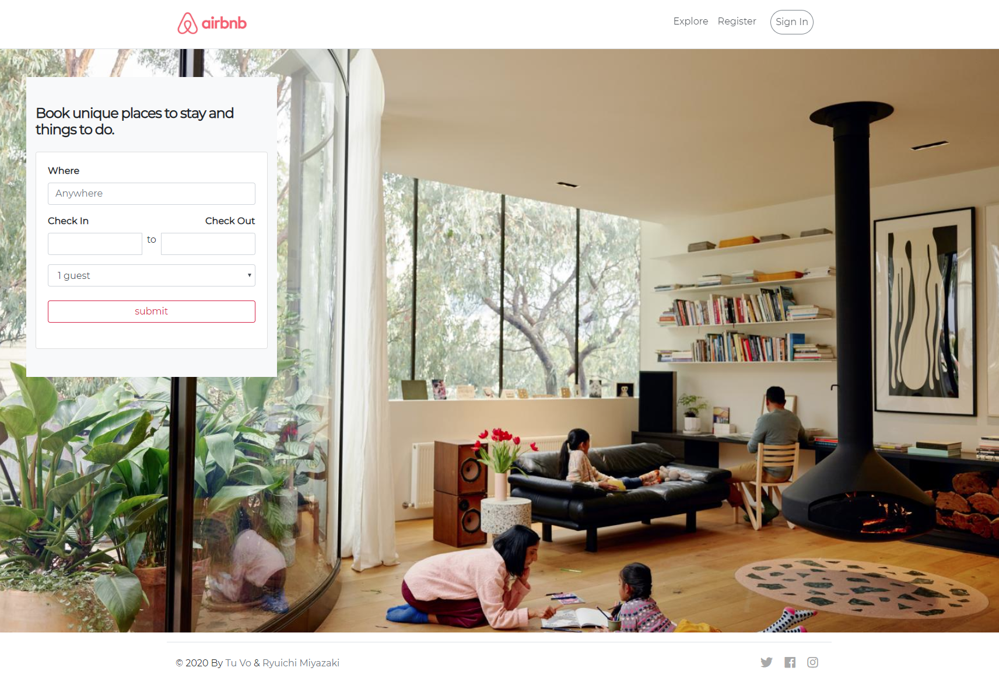
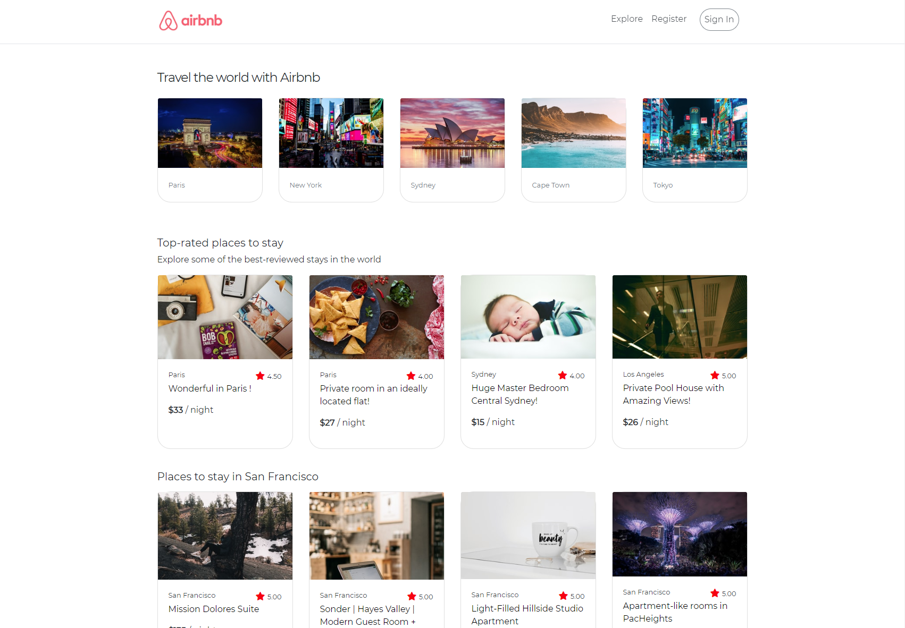
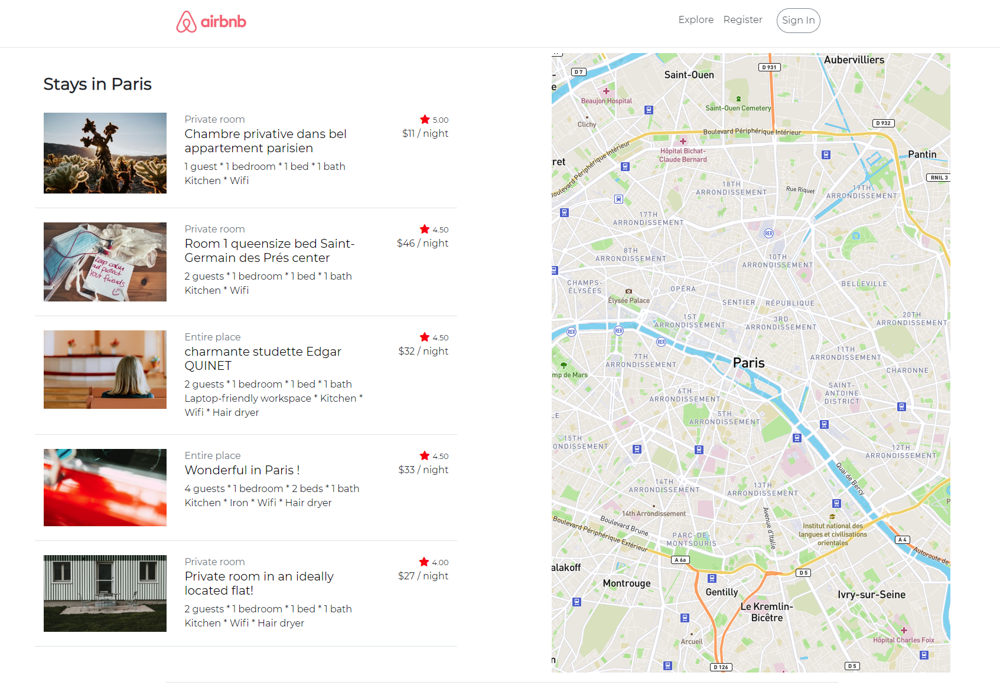
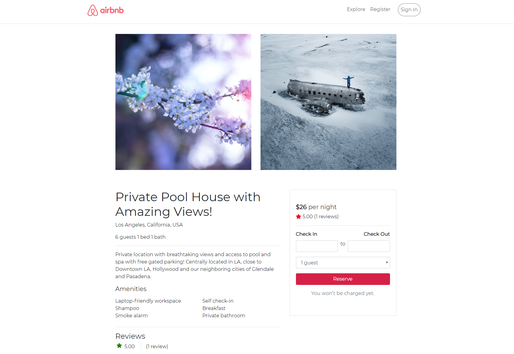
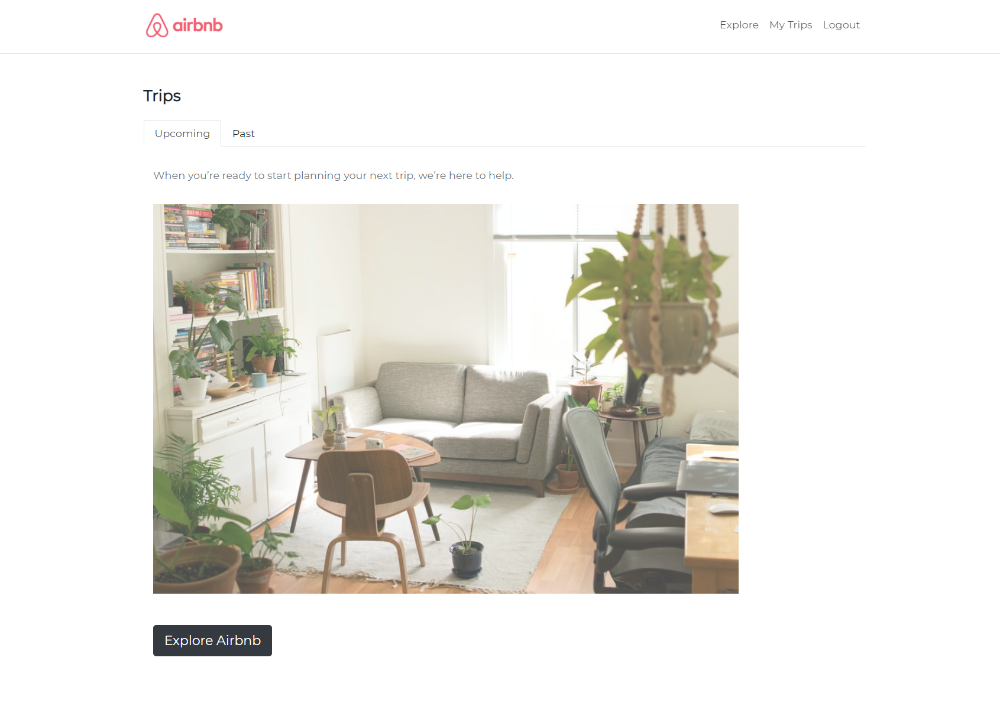
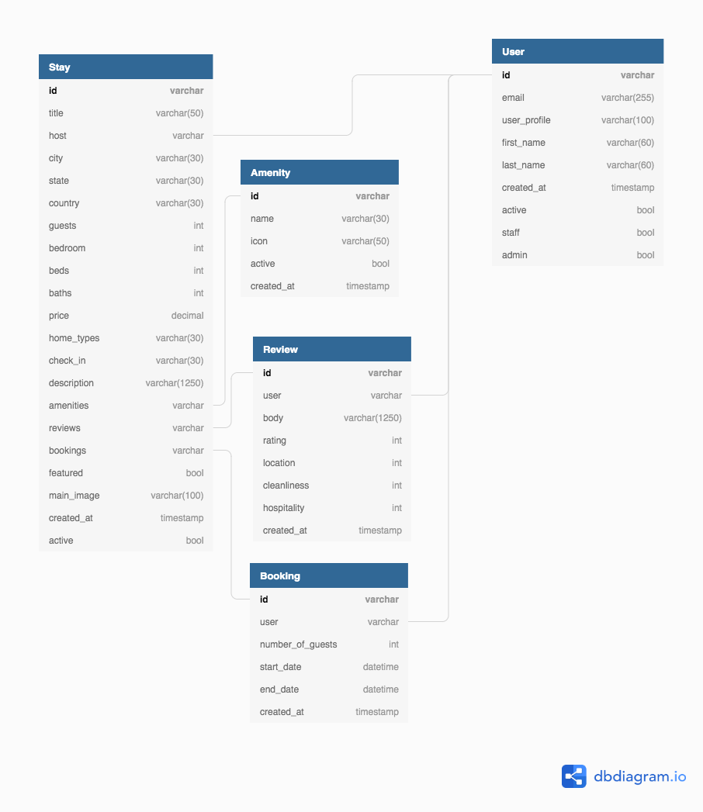

# Hygge Homes

This repository contains a web application to search and book vacation homes created with Python 3.6+, HTML and CSS. The inspiration for this project is to make a Airbnb clone.

## Table of Contents

- [Tech Stack](#tech-stack)
- [Features](#features)
- [Views](#views)
- [Models](#models)
- [Status](#status)
- [Authors](#authors)

## Tech Stack
- Frontend libraries:
  - Bootstrap
  - Jquery
  - FontAwesome
  - Datepicker
- Backend framework
  - Django 3.0 and Jinja2
- Databases
  - SQLite (development)
  - PostgreSQL (production)
- Deployment
  - Amazon Web Services EC2 (Ubuntu 18.04)
  - Amazon Web Services Elastic IP

## Features

Users can:

- register
- login
- view featured stays
- browse top cities
- search stays by city and/or location
- book stays

### API Integrations

#### Stripe

We accept and process credit card payments for bookings using Stripe's API.

#### Unsplash

Images for all of the stays are completely random and are rendered dynamically using Unsplash's API.

#### Mapbox

Maps of cities are rendered using Mapbox's API.

## Views

### Landing

### Explore

### City

### Detail

### My Trips

## Models

Our data has 5 schemas:

- Amenity
- Booking
- Review
- Stay
- User

### Relationships

A user has a one-to-many relationship to review, booking and stay.
A stay has a many-to-many relationship to amenity, review, and booking.

## Status

Project is complete and deployed!
Check it out here: (we are currently getting a domain name)

